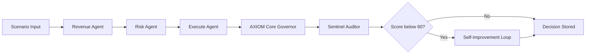

# AXIOM Architecture

AXIOM is a self-governing multi-agent system. Five specialized AI agents powered by Gemini 2.5 Flash deliberate over a business scenario, a Governor issues a binding decision, and an Auditor scores the outcome. If any agent underperforms, the system rewrites that agent's instructions automatically — no human input required.

## Agent Roles

**Revenue** — Sales perspective. Pushes for customer acquisition and revenue growth. Proposes bold commercial actions.

**Risk** — Finance perspective. Protects margins and flags budget exposure. Proposes conservative, numbers-driven actions.

**Execute** — Operations perspective. Focuses on logistics, efficiency, and feasibility. Proposes actions that can actually be implemented.

**AXIOM Core** — The Governor. Receives all three proposals, reads the conflict between them, reasons through the tradeoffs against the company constitution, and issues a binding decision with full written justification.

**Sentinel** — The Auditor. Scores every agent's output 0–100 across five dimensions: constitutional alignment, risk management, business impact, creativity, and feasibility. Triggers the self-improvement loop for any agent scoring below 60.

## LangGraph Orchestration

The graph runs as a deterministic pipeline. Each node receives the full state object and adds its output before passing it to the next node. The Governor node receives all three proposals simultaneously. The Auditor node has access to the full decision context.

## Self-Improvement Loop

When Sentinel scores an agent below 60, AXIOM calls Gemini 2.5 Flash with the agent's current system prompt, the audit feedback, and the scenario context. Gemini rewrites the prompt to correct the identified weaknesses. The new prompt is stored in prompt_history.json with a version number and timestamp. The next run uses the improved prompt automatically.

## Stack

| Layer | Technology |
|---|---|
| Agent Intelligence | Gemini 2.5 Flash via Google AI Studio |
| Orchestration | LangGraph |
| Backend API | FastAPI (Python) |
| Frontend | React + Vite + Tailwind CSS |
| Deployment | Vultr Ubuntu 24.04 + Nginx + systemd |
| Storage | File-based JSON |
